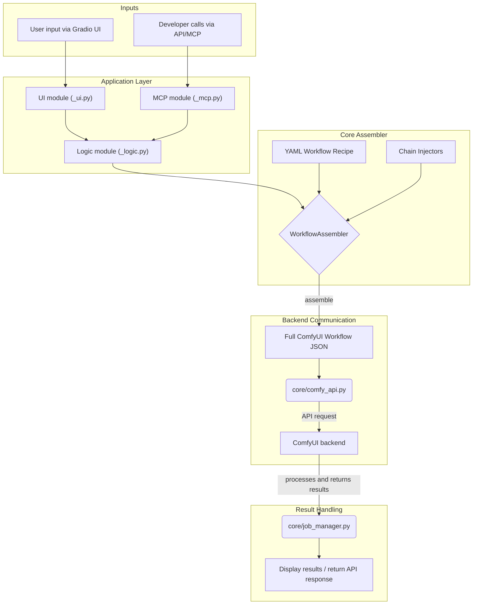

# Comfy web UI — A modular, recipe-driven workflow-as-a-service platform for ComfyUI

[](https://opensource.org/licenses/MIT)

Comfy web UI is more than a modular, mobile-first frontend for ComfyUI — it's a powerful workflow-as-a-service platform. Built on Gradio, it communicates with ComfyUI backends via a dynamic workflow-assembly API. In addition to an intuitive graphical interface, it exposes higher-level APIs and MCP functions so developers can encapsulate complex multi-node workflows into simple, callable functions for automation and integration.

---

## ⚠️ Important Notices

### Development status
> ⚠️ **This project is in active early development.** Features, code structure, and APIs may change frequently. The preset model library is currently intended for testing.

### Security warning
> ⚠️ **This project is designed for use on trusted local networks and has limited built-in security.**
>
> Due to potential security risks, **do not expose this service directly to the public internet without proper hardening.** If remote access is required, we strongly recommend safer approaches:
> - **Virtual LAN tools:** Use tools like [Zerotier](https://www.zerotier.com/) or [Tailscale](https://tailscale.com/) to create a secure private network for your trusted devices.
> - **Authenticated reverse proxy:** Use solutions such as [Cloudflare Access](https://www.cloudflare.com/products/zero-trust/access/) or Nginx Proxy Manager to add an authentication layer and protect your service.

---

## ✨ Key Features

This project integrates many popular AI generation models and utilities into a single, one-stop creative suite.

- **🖥️ Dual UI modes**
  - **[Professional creation panel](https://github.com/RioShiina47/comfy-webui/blob/main/Screenshot/UI/ImageGen/txt2img.png) (ImageGen):** Parameter-rich design offering full creative control. **[HF spaces](https://huggingface.co/spaces/RioShiina/ImageGen-SDXL)** 🤗
  - **[One-tap compact panels](https://github.com/RioShiina47/comfy-webui/blob/main/Screenshot/UI/ImageEdit/Instruction%20%26%20Reference%20Edit/FLUX-2.png) (ImageEdit, VideoGen, AudioGen, 3DGen):** Use best-practice fixed parameters to maximize simplicity, optimized for mobile.

- **🤖 [API & MCP ready](https://github.com/RioShiina47/comfy-webui/blob/main/Screenshot/API_MCP/API_MCP.png) — Workflow as a Service**
  - The project not only provides a UI, but also exposes complex workflow recipes as simple, high-level Python functions via Gradio's API and MCP mechanisms.
  - This makes Comfy web UI a powerful backend for "Workflow as a Service" — any AI client or application that supports the Gradio MCP standard can call these functions to automate and integrate generation tasks.

- **⚡ Asynchronous tasks & history**
  - All generation tasks run asynchronously on the server. Tasks continue even if the browser is closed or the network connection drops.
  - A History page lets you review all past generation results.

- **🔗 Image generation: matrix-style dynamic workflows**

  The image generation features are built around a matrix-style dynamic workflow assembly mechanism. You can freely combine "task dimensions" and "model dimensions" to form dozens of base generation modes.

  - **Task dimension (`task_type`)**: supports `txt2img`, `img2img`, `Inpaint`, `Outpaint`, `Hires. fix`.
  - **Model dimension (`model_type`)**: supports a wide range of model families such as `FLUX.2`, `Z-Image`, `Qwen-Image`, `NewBie-Image`, `Ovis-Image`, `HunyuanImage`, `Chroma1-Radiance`, `Chroma1`, `Lumina`, `HiDream`, `FLUX.1`, `SD3.5`, `SDXL`, `SD1.5`, etc.

  After selecting a base mode, you can stack dynamic capabilities onto the workflow using Chain Injectors:

  - **Dynamic LoRA chains:** Load multiple LoRAs from Civitai, URLs, uploaded files, or local paths and chain them; each LoRA's weight is independently controllable.
  - **Dynamic ControlNet chains:** Stack multiple ControlNets, each with its own control image, type, and model settings.
  - **Dynamic IP-Adapter chains:** Build complex multi-image IP-Adapter networks and finely control each reference image's weight and stylistic influence.
  - **Dynamic Reference Latent chains:** (for FLUX.2 and OmniGen2 models) Enables image editing and combination workflows in multimodal models by injecting multiple reference images.
  - **Dynamic conditioning by region:** Apply independent prompts to different rectangular regions of the image for precise compositional control.
  - **Dynamic style injection:** (for FLUX.1 models) Inject multiple style reference images and control their influence independently.
  - **Dynamic EasyCache chains:** Accelerates the generation process by inserting an EasyCache node.
  - **VAE replacement:** Swap in custom VAE models from Civitai, URLs, or local files at any point in the workflow.

  This enables constructing highly complex workflows with ease. For example:

  > **`SDXL base model`** + **`2 LoRAs`** + **`3 ControlNets`** + **`2 IP-Adapters`** + **`4 regional prompts`** + **`1 style injection`** + **`1 community VAE replacement`** for an **`Inpaint`** task.
  >
  > You only configure the UI; the WebUI automates model downloads, loading, and workflow chaining.

- **🧠 Cross-modal generation & editing**
  - **Instruction & Reference editing:** `FLUX.2`
  - **Instruction editing:** `Qwen-Image-Edit`, `ChronoEdit`, `Flux-Kontext-Dev`, `OmniGen2-Image-Edit` etc.
  - **Reference editing:** `ByteDance USO`
  - **Video generation:** `LTX-2`, `Wan-2.2`, `Wan-2.1`, `HunyuanVideo-1.5`, `HuMo`, `Kandinsky`
  - **Audio generation (ACE-Step):** `txt2music`, `music2music`
  - **3D generation (Hunyuan3D-2):** `Image-to-3D`, `Multi-view-to-3D`

- **🛠️ Utility toolbox**
  - Includes tools such as `Media Info` (a superset of PNG Info), `ControlNet preprocessors`, `background removal (RMBG)`, `video frame interpolation (RIFE - TensorRT)`, and `image/video upscaling (TensorRT)`.

- **🚀 Seamless Integration with Community Resources (e.g., Civitai)**

  Comfy web UI is designed to be the perfect companion for browsing resource-sharing sites like Civitai. Its dynamic resource loading mechanisms (like the dynamic LoRA chains) allow you to rapidly validate and test model resources shared by the community:

  - **Discover:** Find one or more interesting LoRA, Textual Inversion, or VAE models on Civitai.
  - **Copy:** Directly copy the model's version ID from the website or its URL.
  - **Paste & Run:** Paste the IDs into the corresponding input fields in the WebUI (e.g., the LoRA configuration section), adjust the weights, and then click Generate.

  The backend automatically downloads, caches, and dynamically injects the resources into your workflow. This turns the process of testing a variable number of model resources into a seamless and smooth interactive experience.

- **🔩 Architectural advantages: compatibility, multi-backend, and distributed scaling**
  - **Forward compatibility:** The project dynamically queries available node information from ComfyUI via the `/object_info` API at startup. This means the frontend adapts automatically when ComfyUI or custom nodes are updated.
  - **Multi-backend & dependency isolation:** You can create separate ComfyUI Docker environments for different task types (e.g., 3D rendering vs. video processing) to avoid dependency conflicts. Each UI module can intelligently schedule tasks to the appropriate backend.
  - **Smart single-host multi-backend resource management:** When tasks switch, the system can use the `/free` API to instruct idle backends to unload models and free GPU memory, ensuring resources are used efficiently.
  - **Easy extension to distributed physical hosts:** By updating configuration, you can point backends to ComfyUI instances on different physical machines to build a personal AI compute cluster managed through a single Web UI.

---

## 🔧 Technical core: recipe-driven dynamic workflows

The project communicates with ComfyUI via its dynamic workflow assembly API — it does not modify ComfyUI's core.

- **Decoupling & extensibility:** The frontend UI (Gradio) is fully separated from the backend generation engine (ComfyUI). Any ComfyUI workflow can be supported by writing a new recipe and a UI module.
- **Automating complex workflow construction:** The system can programmatically generate complex workflows that would be tedious or error-prone to build manually, such as dynamically constructing multi-layer IP-Adapter networks based on the number of reference images provided by the user.

### Automated long-context workflows

For workflows that support context passing (e.g., sound2video and Animate), the system can automatically build and execute long, chunked workflows in the background based on arbitrarily long input material.

### Plug-and-play modularity

Thanks to a filesystem-based module discovery mechanism, extending and managing features is very simple.

- **Add a feature:** Create a new folder under `frontend/custom/module/` and include `_ui.py` (interface) and `_recipe.yaml` (workflow recipe). After restarting, the new feature appears automatically in the UI layout.
- **Remove a feature:** Delete the corresponding feature folder from `module` or `custom/module`.

This plug-and-play design makes it easy to manage features like plugins, keeps the project tidy, and ensures custom features aren't overwritten by updates.

### Core components

1. **Feature modules (`frontend/module/`)**: Each module defines an independent feature.
   - `_ui.py`: Defines Gradio UI components and events.
   - `_logic.py` (optional): Encapsulates input handling and workflow assembly logic.
   - `_mcp.py` (optional): Defines high-level API / MCP functions for external calls.
2. **Workflow recipes (`frontend/module/.../*_recipe.yaml`)**: Define the "blueprint" of a workflow.
3. **Workflow assembler (`frontend/core/workflow_assembler.py`)**: Reads recipes and dynamically generates the final ComfyUI workflow.
4. **Chain injectors (`frontend/chain_injectors/`)**: Handle dynamic inputs like multiple LoRAs.



---

### 💡 For Developers: Discover the Comfy web UI Core Framework

If you are interested in this project's workflow engine and its "Workflow as a Service" philosophy, and you wish to build your own applications upon it, we offer a standalone, lightweight, core-only version: **`comfy-webui-core`**.

This version strips away all specific UI feature modules (like ImageGen, VideoGen, etc.) and retains only the essential skeleton, including:

-   The dynamic workflow engine (`WorkflowAssembler`)
-   Pluggable Chain Injectors
-   The API & MCP generator
-   The multi-backend management system

`comfy-webui-core` is the perfect choice for you if you are:

-   A developer who **only needs the powerful WaaS (Workflow as a Service) backend** to provide tools for an AI Agent or other applications, without the overhead of the full UI.
-   A developer who wants to **build a highly customized Gradio UI from scratch** without being constrained by existing modules.
-   A researcher who needs a **clean, lightweight starting point** for rapid prototyping and validation.

Click the link below to explore the limitless possibilities with `comfy-webui-core`:

[](https://github.com/RioShiina47/comfy-webui-core)

---

## 🚀 Installation & Usage

### Docker deployment (frontend + multiple backends)

This project is fully containerized. Docker Compose is recommended for one-command deployment.

1. **Prerequisites**:
   - Install [Docker](https://www.docker.com/products/docker-desktop/)
   - Install [NVIDIA Container Toolkit](https://docs.nvidia.com/datacenter/cloud-native/container-toolkit/latest/install-guide.html) to enable GPU access from containers.

2. **Configuration**:
   - The `.env` file at the project root contains environment variables.
   - `docker-compose.yml` defines three services:
     - `backend_defalut`: default ComfyUI backend, listening on port `8188`.
     - `backend_3d`: ComfyUI backend for 3D features, listening on port `8189`.
     - `frontend`: Gradio Web UI, listening on port `7888`.
   - Model, input, and output directories are shared via Docker `volumes` to persist data and make it available across services.
   - Copy `Dockerfile_Example\Dockerfile_Normal.example` into the `ComfyUI` folder and rename it to `Dockerfile`.
   - Copy `Dockerfile_Example\Dockerfile_3D.example` into the `ComfyUI_3D` folder and rename it to `Dockerfile`.
   - Set `auto_download_models` to `true` in `frontend/yaml/config.yaml`, which will automatically traverse the file_list.yaml files in each module to download the required files.

3. **Run**:
   - From the project root, run `run_on_docker.bat` (Windows) or the corresponding shell script.
   - On first run, Docker will build backend images based on the `ComfyUI/Dockerfile` and `ComfyUI_3D/Dockerfile`; this can take some time.
   - After the build, open `http://127.0.0.1:7888` to start using the UI.

### Single-front-end deployment

1. **Prerequisites**:
   - Python 3.10+
   - A running ComfyUI instance.

2. **Install dependencies**:
   - Set `auto_download_models` to `true` in `frontend/yaml/config.yaml` to enable automatic downloads from `file_list.yaml`.
   - From the `frontend` folder, run `install.bat` — it will create a virtual environment and install dependencies.
   - Or install manually:
     ```bash
     cd frontend
     python -m venv venv
     .\venv\Scripts\activate
     pip install -r requirements.txt
     ```

3. **Core configuration**:
   - Copy `frontend/yaml/config.yaml` to `frontend/custom/yaml/config.yaml`.
   - Edit `frontend/custom/yaml/config.yaml` with your local paths and settings, especially `comfyui_path` and `comfyui_backends`.
   - Set `auto_download_models` to `true` in `frontend/yaml/config.yaml`, which will automatically traverse the file_list.yaml files in each module to download the required files.

4. **Run**:
   - From the `frontend` folder, run `run.bat`.

---

## 🏗️ Project structure

```
.
├── ComfyUI/                  # Docker build context for the default ComfyUI backend
├── ComfyUI_3D/               # Docker build context for the 3D ComfyUI backend
├── frontend/                 # Gradio frontend application
│   ├── app.py                # Main application entrypoint
│   ├── requirements.txt
│   ├── chain_injectors/      # Dynamic chain injector modules
│   ├── core/                 # Core backend logic (workflow assembly, API communication, etc.)
│   ├── custom/               # User-customizable UI and YAML configs
│   ├── module/               # Built-in Gradio UI modules
│   │   ├── image_gen/
│   │   │   └── workflow_recipes/ # Image generation workflow recipes
│   │   └── ...
│   └── yaml/                 # Default YAML configuration files
├── .env                      # Environment variables for Docker Compose
└── docker-compose.yml        # Docker Compose configuration
```

---

## ⚙️ Core configuration files (`*.yaml`)

The project's modularity and extensibility rely heavily on a set of carefully designed YAML configuration files. Understanding them is key to customization and extension. Config files fall into two categories: **global configuration** and **UI module configuration**.

All YAML files support an **override mechanism**: create files with the same names in `frontend/custom/yaml/` and those entries will be deep-merged with the defaults in `frontend/yaml/` for non-intrusive customization.

#### **Global configuration files (in `frontend/yaml/`)**

These files define application-wide behavior and base settings.

- `config.yaml`: **core application configuration**.
  - `comfyui_path`: **(required)** the local installation path of ComfyUI.
  - `comfyui_backends`: defines available ComfyUI backend API addresses; supports multi-backend setups (e.g., one for regular tasks and one for 3D tasks).
  - `aria2_path`, `hf_cache_path`: paths for model auto-download tooling and caches.
  - `developer_*`: developer/debugging options.
  - `server_port`, `enable_login`, `share_gradio`: Gradio server startup parameters.
  - `auto_download_models`: whether to automatically download files listed in `file_list.yaml` at startup.

- `injectors.yaml`: **dynamic chain injector registry**.
  - `injector_definitions`: defines available dynamic chain types (e.g., `dynamic_lora_chains`) and their Python module paths.
  - `injector_order`: **(important)** defines the execution priority for injectors. This is critical for handling node dependencies (for example, LoRA injections should occur before ControlNet injections so ControlNet can act on the LoRA-modified model).

- `ui_layout.yaml`: **UI layout configuration**.
  - Defines the display order and hierarchy for main_tabs and sub_tabs.

- `ui_list.yaml`: **UI module load list**.
  - By default the app loads all discovered UI modules. You can limit loaded modules here to speed startup and reduce resource usage.

---

#### **UI module configuration files (in `frontend/module/.../yaml/`)**

These files are specific to UI feature groups (e.g., `image_gen`) and define models, constants, and default parameters for the module.

- `file_list.yaml`: **model auto-download list**.
  - Defines the models and files to check and download at startup.
  - Supports downloads from Hugging Face (`hf`) and Civitai (`civitai`).

- `model_list.yaml` (in `module/image_gen/yaml/`): **image generation model definitions**.
  - Lists large models (checkpoints) available under the ImageGen tab.
  - Supports single-file models (`path`) and multi-component models (`components`, e.g., FLUX, HiDream).
  - `display_name` is used in dropdown menus and as a key for default params.

- `model_defaults.yaml` (in `module/image_gen/yaml/`): **model default generation parameters**.
  - Sets default sampling steps, CFG, prompts, etc., per model architecture (SDXL, SD1.5) or `display_name`.
  - Defaults automatically load when a user switches models in the UI.

- `controlnet_models.yaml` & `ipadapter.yaml` (in `module/image_gen/yaml/`): **ControlNet and IP-Adapter model/preset definitions**.

- `constants.yaml` (in `module/image_gen/yaml/`): **image generation constants**.
  - Defines fixed constants used by the module, such as max LoRA count and resolution presets (`RESOLUTION_MAP`).

- `*_recipe.yaml` (in module directories): **workflow recipes**.
  - **(core)** These define how a feature maps to a ComfyUI workflow.
  - `imports`: allows importing recipe partials for modularity and reuse.
  - `nodes`: lists nodes and their static parameters.
  - `connections`: static node connections.
  - `ui_map`: maps UI component inputs to workflow node parameters.
  - `dynamic_*_chains`: declares which dynamic chain injectors the workflow uses.

---

## 🧩 How to extend

Adding a new feature usually takes four steps:

1. **Write the workflow recipe (`.yaml`)**:
   - Create `_recipe.yaml` under the feature directory, e.g. `frontend/custom/module/my_feature/`.
   - Define nodes, connections, and UI-to-parameter mappings.

2. **Develop the feature module (`.py`)**:
   - Create `_ui.py` in the same folder.
   - Add its tab and recipe path to the `UI_INFO` dictionary.
   - Use `create_ui()` to define Gradio UI components.
   - Implement `run_generation()` to handle data and run the workflow.

3. **Configure UI layout (optional)**:
   - To control exact placement, merge your layout into `frontend/custom/yaml/ui_layout.yaml`.

4. **Add to the UI list (optional)**:
   - If you don't use `include: []` to auto-load all modules in `frontend/custom/yaml/ui_list.yaml`, add your module path (e.g., `custom.ui.my_feature.my_feature_ui`) to that list.

After restarting, your new feature will appear in the WebUI.

---

## 🙏 Credits

This project benefits greatly from the ComfyUI community and many contributors. Special thanks to the authors of the following custom node projects:

- **IP-Adapter:** [cubiq/ComfyUI_IPAdapter_plus](https://github.com/cubiq/ComfyUI_IPAdapter_plus)
- **3D generation:** [MrForExample/ComfyUI-3D-Pack](https://github.com/MrForExample/ComfyUI-3D-Pack)
- **ControlNet preprocessors:** [Fannovel16/comfyui_controlnet_aux](https://github.com/Fannovel16/comfyui_controlnet_aux)
- **And many more...**

---

## 📄 License

### Framework code
This project's own code is licensed under the [MIT License](https://opensource.org/licenses/MIT).

### Models & generated content
Note that this license **does not cover** any models, custom nodes (plugins), or ComfyUI itself that you may use with this tool. You are responsible for understanding and complying with the licenses of those components when creating and using content.
