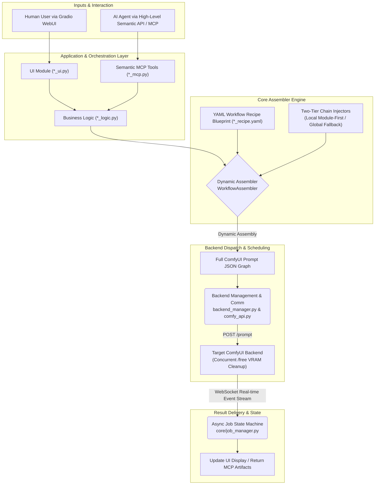

# Comfy web UI — A Modular, Recipe-Driven "Workflow-as-a-Service (WaaS)" Platform for ComfyUI

[](https://opensource.org/licenses/MIT)

Comfy web UI is more than a modular frontend for ComfyUI — it is a powerful **Workflow-as-a-Service (WaaS)** platform. Built on Gradio, it communicates with ComfyUI backends in a fully decoupled manner via dynamic workflow assembly APIs. In addition to an intuitive graphical interface, it exposes high-level semantic APIs and MCP functions so developers can encapsulate complex multi-node workflows into simple, callable functions for automation and integration.

---

## ⚠️ Important Notices

### Development Status
> ⚠️ **This project is in active development.** Features, code structure, and API interfaces may be continuously refactored and updated. The preset model library is primarily provided for testing and verification.

### Security Advisory
> ⚠️ **This project is designed for trusted local network environments and includes limited built-in security defenses.**
>
> Due to potential security risks, **do not expose this service directly to the public internet without strict hardening.** If remote access is required, we strongly recommend adopting the following security practices:
> - **Virtual LAN tools:** Use tools like [Zerotier](https://www.zerotier.com/) or [Tailscale](https://tailscale.com/) to create a secure private network for your trusted devices.
> - **Authenticated reverse proxy:** Use solutions such as [Cloudflare Access](https://www.cloudflare.com/products/zero-trust/access/) or Nginx Proxy Manager to add an authentication layer and protect your service.

---

## ✨ Key Features

Integrating an intuitive graphical interface (UI) with high-level semantic interfaces (MCP / API), this project brings together popular open-source generative models and utilities into a unified, one-stop full-modality creative suite:

- **🔗 Image Generation: Matrix-Style Dynamic Workflow System** **[HF spaces](https://huggingface.co/spaces/RioShiina/ImageGen)** 🤗
  - The image generation features are built around a matrix-style dynamic workflow assembly mechanism. You can freely combine "task dimensions" and "model dimensions" to form dozens of base generation modes.
    - **Task dimension (`task_type`)**: supports `txt2img`, `img2img`, `Inpaint`, `Outpaint`, `Hires. fix`.
    - **Model dimension (`model_type`)**: supports a wide range of model families such as `Krea-2`, `SenseNova-U1.5`, `Mage-Flow`, `JoyAI-Image`, `Boogu-Image`, `PixelDiT`, `ideogram-4`, `Lens`, `FLUX.2`, `Z-Image`, `Qwen-Image`, `ERNIE-Image`, `LongCat-Image`, `Cosmos-Predict2`, `Anima-3.8B-v1.1`, `Anima-3.8B`, `Anima`, `NewBie-Image`, `Kandinsky-5`, `Ovis-Image`, `HunyuanImage`, `Chroma1-Radiance`, `Chroma1`, `Lumina`, `HiDream-O1`, `HiDream-I1`, `FLUX.1`, `AuraFlow`, `SD3.5`, `SDXL`, `SD1.5`, etc.
  - After selecting a base mode, you can stack dynamic capabilities onto the workflow using Chain Injectors:
    - **Dynamic LoRA chains:** Load multiple LoRAs from Civitai, Hugging Face, direct URLs, uploaded files, or local paths and chain them; each LoRA's weight is independently controllable.
    - **Dynamic ControlNet/Krea-2 ControlNet/DiffSynth ControlNet/Anima ControlNet LLLite chains:** Stack multiple ControlNets, each with its own control image, type, and model settings.
    - **Dynamic IP-Adapter chains:** Build complex multi-image IP-Adapter networks and finely control each reference image's weight and stylistic influence.
    - **Dynamic Reference Latent/HiDream-O1 Reference chains:** (for FLUX.2, FLUX.2-KV, OmniGen2 and HiDream-O1 models) Enables image editing and combination workflows by injecting multiple reference images directly into the diffusion latent space.
    - **Dynamic Reference Image/Krea-2 Identity Edit/Krea-2 Style Reference/Joyai-Image/Boogu-Image Edit/Qwen-Image Edit chains:** Enables image editing and combination workflows in multimodal models utilizing VL models as Text Encoder by injecting multiple reference images as visual tokens.
    - **Dynamic conditioning chains:** Apply independent prompts to different rectangular regions of the image for precise compositional control.
    - **Dynamic style injection:** (for FLUX.1 models) Inject multiple style reference images and control their influence independently.
    - **Dynamic EasyCache chains:** Accelerates the generation process by inserting an EasyCache node.
    - **Dynamic PiD replacement:** Use PiD (Pixel Diffusion Decoder) instead of the VAE Decoder for 4x decoding.
    - **Dynamic VAE replacement:** Swap in custom VAE models from Civitai, Hugging Face, direct URLs, or local files at any point in the workflow.
  - This enables constructing highly complex workflows with ease. For example:
    > **`SDXL base model`** + **`2 LoRAs`** + **`3 ControlNets`** + **`2 IP-Adapters`** + **`4 regional prompts`** + **`1 style injection`** + **`1 community VAE replacement`** for an **`Inpaint`** task.
    >
    > You only configure the UI; the WebUI automates model downloads, loading, and workflow chaining.

- **🤖 High-Level Semantic API / MCP — Workflow-as-a-Service (WaaS)** **[Live MCP Endpoint](https://rioshiina-imagegen.hf.space/gradio_api/mcp/)** 🔗
  - The platform exposes complex multi-node workflows as standardized high-level functions via Gradio native APIs and Model Context Protocol (MCP).
  - Any LLM or AI Agent supporting the MCP protocol can directly interface with the service for end-to-end full-modality generation and orchestration.
  - **High-Level Semantic API/MCP**:
    - Our WaaS architecture adopts **High-Level Semantic API/MCP** to replace low-level atomic node API/MCP, aiming to:
    - **Reduced Cognitive Load for LLMs:** Eliminates the need for LLMs to reason over complex topological links and micro-node details, preventing failures caused by broken links, node version conflicts, or topological hallucinations.
    - **Unshakable Contract Stability:** All dynamic node graph construction, multi-chain injection, and VRAM management are handled transparently server-side. Even if underlying custom nodes undergo breaking updates or structural rewrites, the agent-facing MCP API contract remains rock-solid.
    - **Intent-Driven Orchestration:** Frees AI agents from being "node wirers", allowing them to focus purely on high-level creative intent and task orchestration.
  - **8 High-Level Semantic Tools in the ImageGen Module:**
    1. `ImageGen_get_task_list`: **Task Type Probe.** Returns all supported image generation tasks (`txt2img`, `img2img`, `inpaint`, `outpaint`, `hires_fix`) along with required/optional parameter definitions.
    2. `ImageGen_get_model_architecture_list`: **Architecture Probe.** Lists supported model families (`SD1.5`, `SDXL`, `FLUX.1`, `FLUX.2`, `Anima-3.8B`, `Anima-3.8B-v1.1`, etc.), default resolutions, and available resolution presets.
    3. `ImageGen_get_model_list`: **Model Query.** Retrieves available model checkpoints with optional architecture filtering, returning display names, categories, and default trigger prompts.
    4. `ImageGen_get_feature_list`: **Feature & Schema Discovery.** Queries supported chain injectors (LoRA, ControlNet, IP-Adapter, Reference Latent, etc.). Returns token-optimized compact summaries when unparameterized, or full parameter schemas with dynamic model enums and paste-and-run examples when requested (`feature_name`).
    5. `ImageGen_get_model_features`: **Model Metadata & Hyperparam Probe.** Returns a model's supported tasks, active feature chains, and official recommended hyperparameters (`steps`, `cfg`, `sampler`, `scheduler`).
    6. `ImageGen_get_sampler_scheduler_list`: **Sampler & Scheduler Catalog.** Returns all supported samplers and schedulers, organized by general availability and model-architecture-specific support.
    7. `ImageGen_run_imagegen`: **Unified Execution Interface.** Accepts basic generation tasks stacked with multi-layer chain injectors; supports Minimal Mode (auto-injecting default hyperparams) and synchronous/asynchronous execution.
    8. `ImageGen_get_task_status`: **Async Status Polling.** Polls task progress (`queued`, `processing`, `completed`, `failed`), percentage, and generated output URLs via `task_id`.
  - **Progressive Exploration Pipeline for Agents**: Built with a self-describing discovery flow (`Discover Tasks → Filter Architectures → Retrieve Models → Probe Recommended Hyperparameters & Samplers → Submit Execution → Async Status Polling`), enabling Agents to autonomously perceive and utilize platform capabilities.
  - **Zero-Guessing Hyperparameter Engine**: Supports **Minimal Mode** (server automatically applies expert presets) and **Explicit Alignment Mode** (query before passing), completely eliminating hyperparameter hallucination.
  - **Full-Modality Native MCP Tool Suite:**
    1. `ModelGen_img2model`: **Single Image to 3D**. Generates 3D assets from a single input image using Hunyuan3D-2. Accepts `image_url` or `image_data`, returning accessible 3D model files (`shape_model_url` and `textured_model_url`).
    2. `ModelGen_multiview2model`: **Tri-View to 3D**. Generates high-fidelity 3D assets from front, back, and left view images using Hunyuan3D-2mv, returning public URLs to the 3D model.
    3. `AudioGen_music2music`: **Music Re-arrangement**. Re-arranges music clips based on text descriptions, optional lyrics, and input audio (`audio_url` or `audio_data`), returning public URLs to the generated audio.
    4. `AudioGen_txt2music`: **Text to Music**. Creates high-quality music clips from text prompts and optional lyrics using ACE-Step, returning public audio URLs.
    5. `VideoGen_img2video`: **Image to Video**. Generates 16 FPS short video clips from an initial image and motion prompts with customizable aspect ratios, returning public video URLs.
    6. `VideoGen_txt2video`: **Text to Video**. Generates 16 FPS video clips directly from text prompts across multiple resolutions, returning public video URLs.

- **🧠 Cross-modal generation & editing**
  - **Instruction editing:** `FireRed-Image-Edit`, `LongCat-Image-Edit`, `ChronoEdit`, `Flux-Kontext-Dev` etc.
  - **Reference editing:** `ByteDance USO`
    - **Dynamic Subject & Style chains:** (for ByteDance USO) Inject an arbitrary number of subject and style reference images, automatically constructing resolution rescaling, VAE latent encoding, and multi-conditioning fusion chains for each input image.
  - **Video generation:** [`🤗Minimax-H3`](https://huggingface.co/spaces/RioShiina/MiniMax-H3), [`🤗LTX-2.5`](https://huggingface.co/spaces/RioShiina/LTX-2.5), `LTX-2.3`, `LTX-2`, `Wan-2.2`, `Wan-2.1`, `HunyuanVideo-1.5`, `HuMo`, `Kandinsky`
    - **Dynamic Multi-Modal Reference chains:** (for MiniMax-H3 / REF2VA) Dynamically mount arbitrary numbers of reference audios, reference images, and video slices at runtime to expand the model's conditioning guidance network.
    - **Dynamic Track Generation & Concat chains:** (for WanMove) Dynamically generate multiple motion tracks and concatenate them on the fly into complex, continuous camera trajectories.
    - **Dynamic Long-Sequence Chunk Extension chains:** (for Wan 2.2 S2V, InfiniteTalk, Animate) Cooperating with context-passing mechanisms, dynamically calculate chunk counts and recursively assemble multi-stage extension samplers and latent conduits for seamless chunked rendering of long videos.
  - **Audio generation:** `MiniMax-Music3`, `ACE-Step 1.5`, `ACE-Step`
  - **3D generation (Hunyuan3D-2):** `Image-to-3D`, `Multi-view-to-3D`

- **⚡ Asynchronous Tasks & Persistent History**
  - Thread-safe fully asynchronous task scheduling queue. Background tasks continue running uninterrupted even if the browser is closed or the network disconnects.
  - Built-in History management module to review all past creations, inspect generation metadata, and reproduce prompts and parameters with one click.

- **🛠️ Utility Toolbox (Tools)**
  - Built-in `Media Info` metadata reader, `ControlNet Auxiliary Preprocessors`, `TensorRT Hardware-Accelerated Preprocessing (Depth-Anything, DWpose, Video-Depth)`, `Prompt Enhancers (ERNIE, LTX-2, NewBie)`, `Multimodal Vision (QwenVL)`, `Auto-Taggers (WD14, CLIP)`, `Background Removal (RMBG)`, `Video Frame Interpolation (RIFE - TensorRT)`, and `Super-Resolution Upscaling (TensorRT / InvSR)`.

- **🚀 Seamless Integration with Community Resources (Civitai / Hugging Face)**
  - Copy Civitai model version IDs, Hugging Face repository file paths (e.g., `repo_owner/repo_name/model.safetensors`), or direct download URLs, and paste them directly into the WebUI (e.g., LoRA, Embedding, or VAE configuration areas), adjust weights, and click Generate.
  - The backend automatically downloads, caches, and dynamically injects the resources into your workflow. This turns the process of testing a variable number of model resources into a seamless and smooth interactive experience.

- **🔩 Architectural advantages: compatibility, multi-backend, and distributed scaling**
  - **Forward Node Compatibility**: Dynamically queries all available ComfyUI node classes and schema constraints via the `/object_info` API at startup; custom node upgrades or parameter adjustments require zero frontend code changes.
  - **Multi-Backend Isolation & On-Demand Routing**: Supports configuring physically separated ComfyUI backend instances (e.g., `127.0.0.1:8188` for standard generation and `127.0.0.1:8189` for 3D tasks), intelligently routing tasks across separate instances to prevent environment dependency and CUDA conflicts.
  - **Smart Single-Host Multi-Backend VRAM Management**: When switching tasks on a single host, the system automatically issues concurrent `/free` requests to unload models and release GPU memory from inactive backends, ensuring zero-conflict and preventing GPU OOM.
  - **Easy Extension to Distributed Physical Hosts**: By updating configuration, you can point backends to ComfyUI instances on different physical machines to build a personal AI compute cluster managed through a single Web UI.
  - **Decentralized Model Asset Governance**: Each feature module independently maintains its own `file_list.yaml`. The startup process verifies asset integrity and resumes downloads directly from HuggingFace and Civitai, eliminating manual model management.

---

## 🔧 Technical Core: Recipe-Driven Dynamic Workflow Assembly Engine

The platform communicates with ComfyUI exclusively via dynamically assembled Prompt APIs and **never modifies ComfyUI core code**.

- **Decoupling & Extensibility:** The frontend UI (Gradio) is fully separated from the backend generation engine (ComfyUI). Any ComfyUI workflow can be supported by writing a new recipe and a UI module.
- **Automating Complex Workflow Construction:** The system can programmatically and dynamically generate complex workflows on the fly that would be tedious or error-prone to build manually—such as dynamically constructing multi-layer IP-Adapter networks based on the number of reference images, dynamically chaining arbitrary numbers of LoRAs, and composing multiple feature chains.


```mermaid
graph TD
    subgraph "Inputs & Interaction"
        A["Human User via Gradio WebUI"]
        B["AI Agent via High-Level Semantic API / MCP"]
    end

    subgraph "Application & Orchestration Layer"
        C["UI Module (*_ui.py)"]
        D["Business Logic (*_logic.py)"]
        E["Semantic MCP Tools (*_mcp.py)"]
    end

    subgraph "Core Assembler Engine"
        F{"Dynamic Assembler<br/>WorkflowAssembler"}
        G["YAML Workflow Recipe Blueprint (*_recipe.yaml)"]
        H["Two-Tier Chain Injectors<br/>(Local Module-First / Global Fallback)"]
    end

    subgraph "Backend Dispatch & Scheduling"
        I["Full ComfyUI Prompt JSON Graph"]
        J("Backend Management & Comm<br/>backend_manager.py & comfy_api.py")
        K["Target ComfyUI Backend<br/>(Concurrent /free VRAM Cleanup)"]
    end

    subgraph "Result Delivery & State"
        L("Async Job State Machine<br/>core/job_manager.py")
        M["Update UI Display / Return MCP Artifacts"]
    end

    A --> C
    B --> E
    C --> D
    E --> D
    D --> F
    G --> F
    H --> F
    F -- Dynamic Assembly --> I
    I --> J
    J -- POST /prompt --> K
    K -- WebSocket Real-time Event Stream --> L
    L --> M
```

### Automated long-context workflows

For workflows that support context passing (e.g., sound2video, Animate, infinitetalk, etc.), the system can automatically build and execute long, chunked workflows in the background based on arbitrarily long input material.

---

### 💡 For Developers: Discover the Comfy web UI Core Framework

If you are interested in this project's dynamic workflow assembly engine and its "Workflow-as-a-Service (WaaS)" philosophy, and you wish to build your own specialized applications upon it, we provide a standalone, lightweight, core-only repository: **`comfy-webui-core`**.

This version strips away all specific UI feature modules (such as ImageGen, VideoGen, etc.) and retains only the essential architecture skeleton:

- The dynamic workflow assembly engine (`WorkflowAssembler`)
- The pluggable chain injector system (Chain Injectors)
- Automated high-level API & native MCP tool generation
- Multi-backend isolation & zero-conflict VRAM scheduling

[](https://github.com/RioShiina47/comfy-webui-core)

---

## 🚀 Quick Installation & Setup

### Local Standalone Setup (Recommended)

1. **Prerequisites**:
   - Python 3.10+
   - A running ComfyUI instance (e.g., `http://127.0.0.1:8188`).

2. **Install Dependencies**:
   - Open a terminal and run:
     ```bash
     git clone https://github.com/RioShiina47/comfy-webui.git
     cd comfy-webui
     python -m venv venv
     # Activate the virtual environment on Windows:
     .\venv\Scripts\activate
     pip install -r requirements.txt
     ```
   - **Tailor Modules & UI Layout**: The platform features full-modality modules with a **plug-and-play auto-discovery mechanism**. Before launching, we recommend retaining only the modules you actually need by deleting unused directories under `module/`, then adjusting the tab hierarchy in `yaml/ui_layout.yaml` accordingly.
   - **Automatic Model Download Strategy**: To prevent unintentional large-scale weight downloads from consuming bandwidth and disk space, `auto_download_models` is disabled by default (`false`). Please inspect the `file_list.yaml` asset manifests within your retained modules to ensure they meet your expectations before setting `auto_download_models` to `true` in `yaml/config.yaml`.

3. **Core Configuration**:
   - Check and edit `yaml/config.yaml`:
     - `comfyui_path`: Set to the actual absolute installation path of your local ComfyUI.
     - `comfyui_backends`: Configure backend port mappings (default: `default: http://127.0.0.1:8188`; if you have a 3D backend, configure `3d_backend: http://127.0.0.1:8189`).
     - `huggingface_token` / `civitai_api_key`: Provide tokens/keys if downloading gated or authenticated models.

4. **Launch Service**:
   - Run directly from the project root:
     ```bash
     python app.py
     ```
   - Once started, access the WebUI in your browser at the address shown in the console (default: `http://127.0.0.1:7860`).

---
---

## ⚙️ Core Configuration Files (`*.yaml`)

The modularity and extensibility of the platform rely heavily on declarative YAML configuration files. These are divided into **Global Configuration** and **UI Module Configuration**:

#### **Global Configuration Files (`yaml/`)**

These files govern global server runtime parameters, backend endpoints, and navigation layout:

- `config.yaml`: **Core Application Configuration**
  - `comfyui_path`: Local absolute installation directory of ComfyUI.
  - `comfyui_backends`: Mapping of named ComfyUI backend endpoints (supports multi-backend isolation, e.g., `default: http://127.0.0.1:8188` and `3d_backend: http://127.0.0.1:8189`).
  - `wait_for_all_backends`: Whether to block startup until all configured backends pass health checks.
  - `save_workflow_to_json`: Dumps compiled workflow prompt JSON graphs for debugging and introspection.
  - `civitai_api_key`, `huggingface_token`: API credentials for downloading gated or private models.
  - `enable_login`, `login_credentials`: Gradio authentication credentials for secure access.
  - `auto_download_models`: When enabled (`true`), automatically traverses all module `file_list.yaml` manifests at startup to verify and download missing weights.

- `ui_layout.yaml`: **Navigation Layout Hierarchy**
  - Defines the ordering, naming, and nesting hierarchy for main tabs and sub-tabs.

---

#### **UI Module Configuration Files (`module/<module>/...`)**

Each functional module (such as `module/imagegen/`, `module/video_gen/`) encapsulates its own domain-specific configs, model dependencies, and workflow definitions:

- `file_list.yaml`: **Model Dependency Manifest**
  - Declares all remote weights required by the module for automated downloading.
  - Supports sources from Hugging Face (`hf`) and Civitai (`civitai`), specifying repository IDs, file paths, and local destination directories.

- `model_list.yaml` (in `module/imagegen/yaml/`): **Checkpoint Model Definitions**
  - Catalogs models available in the module.
  - Supports single-file checkpoints (`path`) and complex multi-component models (`components`, e.g., FLUX, HiDream, Anima).
  - Configures display names, categories, default trigger prompts, and architectural types.

- `model_defaults.yaml` (in `module/imagegen/yaml/`): **Expert Hyperparameter Presets**
  - Maps default generation parameters (sampling steps, CFG scale, sampler, scheduler, denoise) based on model architecture (e.g., SDXL, SD1.5, FLUX) or specific `display_name`.
  - Automatically populates the UI when switching models to eliminate user guesswork.

- `controlnet_models.yaml` & `ipadapter.yaml`: **Adapter Model Registries**
  - Defines available ControlNet, T2I-Adapter, and IP-Adapter presets, associated preprocessor types, and weights.

- `task_features.yaml` & `chain_features.yaml` (in `module/imagegen/yaml/`): **Task & Chain Feature Schemas (MCP / Semantic API)**
  - Declaratively defines schemas, argument types, dynamic enum sources (e.g. available ControlNet/IP-Adapter models), and runnable example payloads for all tasks and chain injectors exposed via MCP.

- `constants.yaml`: **Module Constants**
  - Defines fixed domain presets, such as resolution options (`RESOLUTION_MAP`), aspect ratios, and maximum LoRA stack limits.

- `ui_constants.yaml`: **UI Dropdown Options**
  - Defines shared dropdown options such as sampler names, scheduler algorithms, and preset selections (recursively deep-merged into global components).

- `*_recipe.yaml`: **Workflow Blueprint Recipes (Core Engine)**
  - Declaratively defines how UI inputs transform into an executable ComfyUI node graph:
    - `imports`: Modularly imports and composes recipe partials (e.g., sampler skeletons, conditioning sub-graphs) for cross-modal reuse.
    - `nodes`: Specifies ComfyUI node class types (`class_type`), titles, and static default parameters.
    - `connections`: Declares directional wiring between output slots and input slots across nodes (`from: "node_a:slot"`, `to: "node_b:slot"`).
    - `ui_map`: Declarative bindings connecting Gradio UI components directly to target node input parameters (`input_name: "node_id:param"`).
    - `dynamic_*_chains`: Defines hook points where chain injectors dynamically insert custom subgraphs (e.g., multi-LoRA stacks, ControlNets, EasyCache, or style references).

---

## 🧩 Development and Feature Extension Guide

### 1. Adding a New Feature

Adding a new generative capability is straightforward thanks to loose modular coupling:

1. **Create Module Directory**: Create a feature folder under `module/` (e.g., `module/video_gen/my_diffusion/`).
2. **Write Workflow Recipe (`my_recipe.yaml`)**: Define ComfyUI node topology, connections, and parameter bindings.
3. **Develop Frontend Interface (`my_ui.py`)**:
   - Define the `UI_INFO` specification dictionary (specifying `main_tab`, `sub_tab`, `target_backend`, etc.).
   - Implement `create_ui()` to build the component tree, and `run_generation(ui_values)` to execute the generation logic.
4. **(Optional) Declare Models (`file_list.yaml`)**: List required model weights and remote sources for automatic downloading at startup.
5. **(Optional) Expose Agent MCP Tools (`my_mcp.py`)**: Define high-level semantic MCP functions and expose them via `MCP_FUNCTIONS` for automated registration.

### 2. Removing Features

Thanks to automatic discovery and modular decoupling, removing a feature requires no modification to core loaders—simply physically delete the module:

1. **Delete the Feature Directory**: Directly remove the feature folder under `module/` (e.g., `module/video_gen/my_diffusion/`). Because the loader dynamically scans the directory tree at startup, deleting the module cleanly removes its UI tab, ComfyUI recipe, and registered MCP tools without any side effects on other modalities.
2. **Clean up Layout (`ui_layout.yaml`)**: If the feature had an explicit tab ordering entry in `yaml/ui_layout.yaml`, remove that entry.
3. **(Optional) Clean up Model Weights**: Check the module's original `file_list.yaml` and remove associated model files under `ComfyUI/models/` to reclaim disk space.

---

## 📄 License

- **Framework Code**: This project's code is licensed under the [MIT License](https://opensource.org/licenses/MIT).
- **Models & Generated Content**: Note that this license **does not cover** any third-party model weights, custom ComfyUI nodes, or ComfyUI itself that you may use with this tool. Please comply with respective open-source licenses and commercial terms when creating and distributing content.
